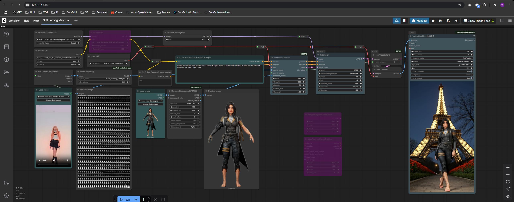

# Workflow: Wan Self Forcing + VACE

<video controls width="100%">
  <source src="./assets/SelfForcing_00222.mp4" type="video/mp4">
  Seu navegador não suporta vídeo incorporado.
</video>

Este workflow usa o modelo derivado do Wan2.1 com a técnica **Self Forcing**, integrado ao pipeline de geração de vídeo **VACE (Video Autoencoding via Composition and Editing)**.

O foco aqui é performance: geração de vídeos curtos com alta qualidade visual, mesmo em setups locais modestos.

---

## ▶️ Como usar

1. Baixe o workflow (.json)
2. Carregue o workflow no ComfyUI.
3. Insira:
   - Um **vídeo de referência** (animação/movimento)
   - Uma **imagem de referência** (personagem, rosto, etc.)
   - Prompt Positivo
4. (Opcional) Aplique LoRAs para adicionar estilo artístico.
5. Execute o pipeline.

> ⚠️ Importante: O KSampler utiliza LCM, então o **prompt negativo deve ser deixado em branco**.

---

## 📌 Detalhes técnicos

- Resolução atual: **480p** (exemplo: 832x480)
- Duração: aproximadamente **5 segundos**
- Frame rate: **16fps**
- Tempo médio de geração: **~2 minutos** em hardware modesto

---

## 🎨 Personalização

- Altere o método de Depth Map conforme sua preferência.
- Troque a imagem de referência para diferentes personagens.
- Aplique LoRAs para adicionar estilo ou identidade visual ao vídeo.

> 💡 Caso a imagem de referência não esteja sendo levada em consideração, provavelmente o modelo não removeu seu fundo corretamente. Tente com uma imagem sem fundo (canal alpha transparente, salva como `.png`).
